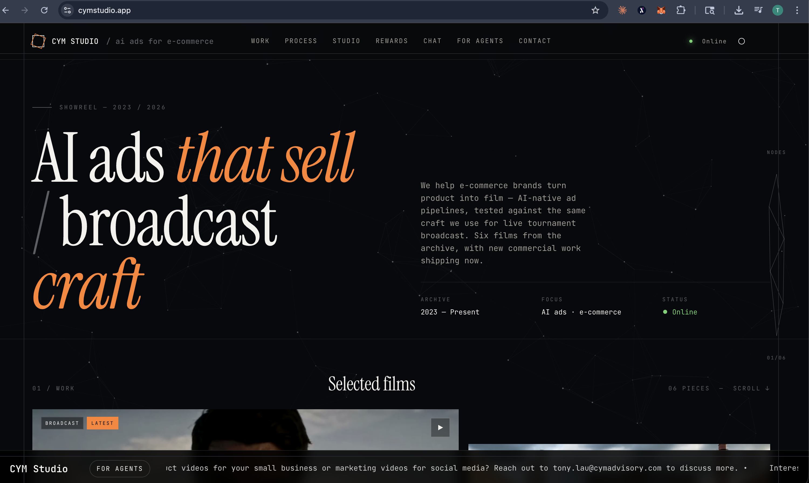
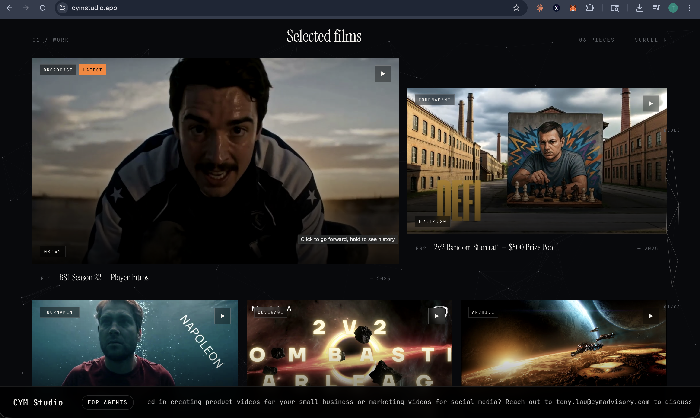

# CYM Studio — Tournament Prize Redemptions on Conflux eSpace

Gasless gift-card redemptions paid in USDT0 on Conflux eSpace. Tournament winners convert prize tokens into real-world gift cards across 300+ brands without ever holding native gas.

[](LICENSE)
[](https://confluxnetwork.org)
[](https://github.com/conflux-fans/global-hackfest-2026)
[](https://evm.confluxscan.org/address/0xaf37e8b6c9ed7f6318979f56fc287d76c30847ff)


> **Live at** [cymstudio.app](https://cymstudio.app) · **Rewards** [cymstudio.app/catalogue](https://cymstudio.app/catalogue) · **Agent docs** [cymstudio.app/agents](https://cymstudio.app/agents) · **Chat** [cymstudio.app/chat](https://cymstudio.app/chat)

## 🏆 Global Hackfest 2026

This repo is a submission for the [Conflux Global Hackfest 2026](https://github.com/conflux-fans/global-hackfest-2026), targeting the **Best USDT0 integration** category.

**The pitch:** Tournament organizers pay winners in stablecoins, then winners get stuck — off-ramps are slow, fiat gift-card services need CFX for gas. This project closes the last mile: a winner with **USDT0 on Conflux eSpace and zero CFX** can redeem a real Amazon / Apple / Pacific Coffee card in three clicks, paid entirely in USDT0. A shared x402 facilitator covers every gas fee.

**Team:** Tony Lau / Pulse520 · **Focus area:** Payments and Stablecoins · **Submission date:** 2026-04-20

See [`submission/README.md`](submission/README.md) for the full hackathon submission document (problem statement, go-to-market plan, demo script, roadmap, etc.).

## What's in the repo

Three user-facing surfaces, one shared x402 payment pipeline, and a native MCP server so AI agents can reach the same infrastructure programmatically.

| Surface | Path | Purpose |
|---|---|---|
| Editorial showreel | `/` | AI video-production portfolio for CYM Studio — the operating entity behind the rewards program |
| Tournament Prize Redemptions | `/catalogue` | 300+ brand catalogue with wallet-signed USDT0 / USDC checkout |
| AI concierge | `/chat` | Natural-language chat powered by Kimi (Moonshot), tools resolved via our own MCP |
| Agent docs | `/agents` | MCP integration guide for third-party AI agents |
| MCP endpoint | `/api/mcp/rewards` | JSON-RPC 2.0 server — 12 tools for discovery, email verification, x402 quote + purchase |
| ERC-8004 registration | `/.well-known/gift-cards/agent-registration.json` | Agent-registry entry (agent ID 22628, Ethereum mainnet) |

## Tour

### Editorial showreel — [`/`](https://cymstudio.app)

The AI video-production portfolio for CYM Studio — the operating entity behind the rewards program.






### Tournament Prize Redemptions — [`/catalogue`](https://cymstudio.app/catalogue)

300+ brand catalogue, filterable by country and currency. Connected wallets see live USDT0 / USDC balances in the sidebar.


**Gasless checkout.** Pick a network, confirm the token breakdown (reward value, FX, service fee), enter email for voucher delivery, and sign one EIP-3009 authorization — the facilitator pays the CFX/ETH gas.

<table>
  <tr>
    <td width="50%"></td>
    <td width="50%"></td>
  </tr>
</table>

### AI concierge — [`/chat`](https://cymstudio.app/chat)

Natural-language browsing powered by Kimi. Every user turn routes through the same MCP server an external agent would call — so the chat is a live demo of the agent integration.

<table>
  <tr>
    <td width="50%"></td>
    <td width="50%"></td>
  </tr>
</table>

## Why Conflux eSpace

- **USDT0 is the default.** Native Tether on Conflux eSpace is a first-class citizen — live contract at [`0xaf37E8B6C9ED7f6318979f56Fc287d76c30847ff`](https://evm.confluxscan.org/address/0xaf37E8B6C9ED7f6318979f56Fc287d76c30847ff).
- **Gasless by design.** EIP-3009 `transferWithAuthorization` lets a shared facilitator ([`0xc10561…a4Ee`](https://evm.confluxscan.org/address/0xc10561C1c0d718B3D362df9D510A1b4e4331a4Ee)) submit transfers on behalf of users. The facilitator pays CFX; the buyer only ever touches USDT0.
- **Same UX, two rails.** The same checkout works on Ethereum mainnet (USDC) for users whose stablecoins live there. Conflux eSpace is the default because USDT0 + the facilitator gas sponsorship make it the cheapest and smoothest path.
- **Agent-native.** An AI agent with its own USDT0-funded wallet can discover and buy gift cards via MCP with no human in the loop — see `get_purchase_quote` + `submit_purchase` tools.

## Architecture

Three user-facing entry points (catalogue, chat, MCP) all land in the same x402 purchase pipeline. One codebase, one security model, one on-chain settlement path.

```
┌──────────────────────┐    ┌──────────────────────┐    ┌──────────────────────┐
│  /catalogue          │    │  /chat               │    │  AI agent (external) │
│                      │    │                      │    │                      │
│  Visual browse +     │    │  Kimi (Moonshot)     │    │  Any MCP client      │
│  filters +           │    │  + tool-use loop     │    │  (Claude Desktop,    │
│  PurchaseModal       │    │  /api/chat           │    │  custom agents,      │
│                      │    │                      │    │  server wallets)     │
└──────────┬───────────┘    └──────────┬───────────┘    └──────────┬───────────┘
           │                           │                           │
           │                           │ tools/call                │ tools/call
           │                           ▼                           ▼
           │                 ┌─────────────────────────────────────────────────┐
           │                 │  /api/mcp/rewards — native MCP JSON-RPC 2.0     │
           │                 │                                                 │
           │                 │  Discovery:     search_giftcards, get_brand_... │
           │                 │                 list_countries, list_currencies │
           │                 │                                                 │
           │                 │  Agent purchase (server-side wallet):           │
           │                 │    get_purchase_quote, submit_purchase          │
           │                 │    verify_email_start, verify_email_complete    │
           │                 │                                                 │
           │                 │  Order lookup:  check_order_status              │
           │                 │                 redirect_to_checkout            │
           │                 └─────────────────────────┬───────────────────────┘
           │                                           │
           │    user-wallet click-through              │ agent-wallet submit_purchase
           │    opens PurchaseModal                    │ posts signed envelope
           ▼                                           ▼
           ┌─────────────────────────────────────────────────────────────────────┐
           │  /api/purchase — single x402 settlement endpoint                    │
           │                                                                     │
           │  Email OTP gate · idempotency on nonce · order bounds ($1–$5k)     │
           │  Overpayment ceiling (5%) · facilitator gas health pre-check       │
           └──────────────────────────────────┬──────────────────────────────────┘
                                              │
                                              ▼
              ┌───────────────┐   ┌───────────────┐   ┌───────────────┐
              │ Conflux /     │   │ xRemit        │   │ Resend        │
              │ Ethereum      │   │ gift-card     │   │ voucher       │
              │ facilitator   │   │ provider      │   │ email         │
              │ submits tx    │   │ (HMAC webhook)│   │ delivery      │
              └───────────────┘   └───────────────┘   └───────────────┘
```

**Two signing models, one pipeline:**

- **User-wallet flow** (catalogue + chat): browser signs EIP-3009 via Reown/wagmi → `/api/purchase` → facilitator settles. Chat adds natural-language discovery on top; the signing UX is identical to the catalogue.
- **Agent-wallet flow** (MCP purchase tools): server-side wallet signs EIP-3009 programmatically → `submit_purchase` → `/api/purchase` → same facilitator settlement. No browser, no human.

Both paths produce the same `orders` row, the same on-chain `transferWithAuthorization` event, the same xRemit voucher procurement, the same email delivery. The only divergence is who held the key that signed.

## Tech stack

- **Framework** — Next.js 14 App Router, React 18, TypeScript
- **Styling** — Tailwind CSS + CSS Modules, `next/font/google` (Instrument Serif · Inter · JetBrains Mono)
- **Wallets** — Reown AppKit, wagmi, viem, ethers v6
- **Payments** — x402 protocol with gasless EIP-3009 settlement
- **Provider** — xRemit (gift-card fulfillment, HMAC-signed webhooks)
- **AI** — Kimi (Moonshot's `kimi-k2-0711-preview`) with native tool-calling
- **MCP** — JSON-RPC 2.0 over HTTPS at `/api/mcp/rewards` (12 tools)
- **Backend** — Supabase (Postgres + service role), Next.js API routes
- **Email** — Resend (OTP verification, 30-day re-verification window)
- **Sanitization** — DOMPurify for provider HTML
- **Hosting** — Vultr VPS (Nginx + PM2 + Let's Encrypt)

## Supported payment networks

| Network           | Chain ID | Token | Strategy          | Minimum facilitator gas |
|-------------------|----------|-------|-------------------|-------------------------|
| Conflux eSpace    | 1030     | USDT0 | EIP-3009 gasless  | 10 CFX                  |
| Ethereum mainnet  | 1        | USDC  | EIP-3009 gasless  | 0.01 ETH                |

Shared facilitator address across chains: `0xc10561C1c0d718B3D362df9D510A1b4e4331a4Ee`
Network + facilitator config lives in [`config/networks.ts`](config/networks.ts). The health endpoint at [`/api/facilitator-health`](app/api/facilitator-health/route.ts) reports live gas balances.

## Merchant protection

- Email OTP verification via Resend (30-day re-verification)
- IP-based sliding-window rate limiting on all API routes ([`middleware.ts`](middleware.ts))
- Per-wallet 10-second cooldown on purchase attempts
- Order bounds: $1 minimum, $5,000 maximum
- 5% overpayment threshold with `pending_review` fallback
- Facilitator gas health check before every settlement
- 90-second settlement timeout with idempotency guard on authorization nonces
- Auto-refund when the xRemit provider fails to fulfill
- HMAC webhook signature verification on provider callbacks
- x402 payment signature verification server-side

## Agent-initiated purchases (MCP)

Any AI agent with its own wallet can complete the full purchase loop via the MCP — five tool calls, zero UI.

```
1.  verify_email_start        → OTP sent
2.  verify_email_complete     → email verified for 30 days
3.  get_purchase_quote        → x402 payment requirements + EIP-712 domain + types
4.  [ agent wallet signs EIP-3009 TransferWithAuthorization ]
5.  submit_purchase           → order_id + voucher
```

Full integration guide (curl, Python, Claude Desktop config, EIP-3009 signing with `viem`): [`/agents`](https://cymstudio.app/agents) or the route source at [`app/agents/page.tsx`](app/agents/page.tsx).

## Project layout

```
app/
  page.tsx                  Editorial showreel (landing)
  page.module.css           Landing palette + sections
  catalogue/                Tournament Prize Redemptions
  chat/                     Kimi-powered conversational concierge
  agents/                   MCP integration docs for developers
  onramp/                   OSL Pay fiat onramp (optional)
  api/
    brands/                 Gift card catalogue sync
    chat/                   Kimi chat/completions + MCP tool dispatch loop
    mcp/rewards/            Native MCP JSON-RPC 2.0 server (12 tools)
    purchase/               x402 payment + order creation
    webhook/                xRemit fulfillment callback
    orders/                 Order status polling
    email/                  OTP send/verify
    exchange-rate/          FX quotes for non-USD brands
    facilitator-health/     Gas balance + liveness
    mastercards/            Virtual Mastercard catalogue
    sync-brands/            Admin brand refresh
    newsletter/             Newsletter signup
    cron/                   Scheduled tasks
components/
  landing/                  ParticleField, NeuralNav, ShowreelGrid, TopBar
  catalogue/                GiftCardCatalog, PurchaseModal, CatalogueRoot
  chat/                     ChatInterface, ChatMessages, types
  onramp/                   OSL Pay integration UI
  _archive/                 Retired components kept for git history
config/
  networks.ts               Chains, tokens, facilitator, gas floors
  oslPay.ts                 OSL Pay onramp config
  wagmi.ts                  Wallet connectors
lib/
  x402-client.ts            Client-side x402 signing helpers
  x402-server.ts            Server-side settlement
  xremit.ts                 xRemit API client
  email.ts                  Resend email templates
  rate-limit.ts             Sliding-window rate limiter
  exchange-rates.ts         FX lookup with cache
public/.well-known/
  gift-cards/
    agent-registration.json  ERC-8004 registration document
deploy/
  setup-vps.sh              Vultr VPS provisioning
  nginx.conf                Nginx reverse-proxy config
  deploy.sh                 Deploy script (pull + build + PM2 restart)
submission/
  README.md                 Full Global Hackfest 2026 submission doc
```

## Quickstart

```bash
npm install
cp .env.example .env    # then fill in the values
npm run dev             # http://localhost:3000
```

## Environment variables

At minimum the following must be set. See [`.env.example`](.env.example) for the complete list.

```bash
# Supabase
NEXT_PUBLIC_SUPABASE_URL=
NEXT_PUBLIC_SUPABASE_ANON_KEY=
SUPABASE_SERVICE_ROLE_KEY=

# x402 facilitator
FACILITATOR_PRIVATE_KEY=                    # optionally FACILITATOR_MAINNET_PRIVATE_KEY
X402_MAINNET_FACILITATOR_ADDRESS=
X402_FACILITATOR_ADDRESS=

# RPC endpoints (server + client)
ETHEREUM_MAINNET_RPC_URL=
NEXT_PUBLIC_ETHEREUM_RPC_URL=
CONFLUX_ESPACE_RPC_URL=
NEXT_PUBLIC_CONFLUX_RPC_URL=

# Provider
EXTERNAL_API_KEY=
EXTERNAL_CLIENT_SECRET=
XREMIT_WEBHOOK_API_KEY=
XREMIT_ENV=production

# Email + FX
RESEND_API_KEY=
RESEND_FROM_EMAIL=
API_LAYER_KEY=

# Reown AppKit
NEXT_PUBLIC_WALLETCONNECT_PROJECT_ID=

# Kimi (Moonshot AI) — powers /chat
KIMI_API_KEY=
# Optional: KIMI_BASE_URL, KIMI_MODEL

# App URL (webhook callbacks)
NEXT_PUBLIC_API_URL=https://cymstudio.app
```

## Deployment

The site runs on a **Vultr VPS** behind Nginx with PM2 managing the Node process and Let's Encrypt for TLS. See [`deploy/setup-vps.sh`](deploy/setup-vps.sh) for first-time provisioning and [`deploy/deploy.sh`](deploy/deploy.sh) for incremental deploys.

```bash
# First-time setup (on the VPS)
bash deploy/setup-vps.sh

# Incremental deploy from your local machine
bash deploy/deploy.sh root@<vps-ip>

# Or on the VPS directly
cd /var/www/cymstudio
git pull origin main
NODE_OPTIONS="--max-old-space-size=1792 --dns-result-order=ipv4first" npm run build
pm2 restart cymstudio --update-env
```

## Database

Schema is managed against the live Supabase project via the dashboard SQL editor. Migration SQL files are kept locally at `supabase/migrations/` for reference but are gitignored — apply them via Supabase dashboard → SQL Editor → Run.

## About CYM Studio

CYM Studio builds AI ads for e-commerce brands — built on a pipeline forged in live broadcast. Generative tools let us move faster and take bigger swings; the cut, the hook and the grade are still hand-made. Proud clients include **Bombastic Starleague** and various Starcraft: Brood War tournament organizers. The Tournament Prize Redemptions catalogue was designed as the official redemption surface for these events.

## Featured work

- BSL Season 22 — Player Intros
- BSL Starleague 22 — RO32 Week 2
- 2025 2v2 Random Starcraft Brood War Tournament ($500 prize pool)
- Season 3 Bombastic Starleague 2v2 Tournament ($1,000 prize pool)
- Bombastic Starleague Qualifications Season 3
- 2023 2v2 Shield Battery Tournament ($500 prize pool)

## Contact

Email: [tony.lau@cymadvisory.com](mailto:tony.lau@cymadvisory.com)
GitHub: [intrepidcanadian/cymstudios](https://github.com/intrepidcanadian/cymstudios)

## License

Copyright © 2026 CYM Studio. All rights reserved.

---

**Built for Global Hackfest 2026 · Best USDT0 integration**
