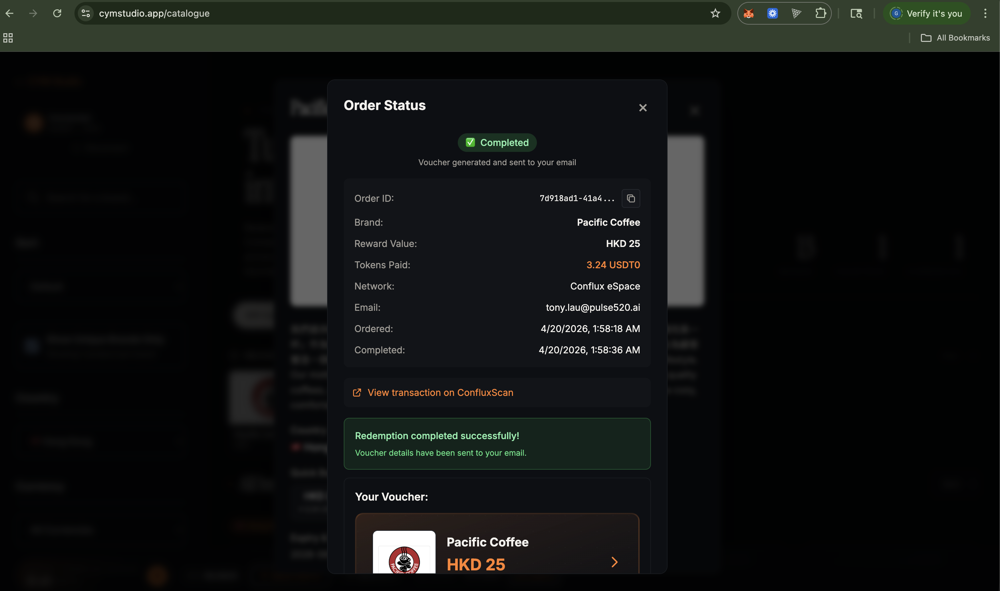

# CYM Rewards — Tournament Prize Redemptions on Conflux eSpace

One-line description: Gasless gift-card redemptions paid in USDT0 on Conflux eSpace. Tournament winners convert prize tokens into 300+ real-world gift cards without ever holding CFX.

[](LICENSE)
[](https://confluxnetwork.org)
[](https://github.com/conflux-fans/global-hackfest-2026)
[](https://evm.confluxscan.org/address/0xaf37e8b6c9ed7f6318979f56fc287d76c30847ff)

## Overview

CYM Rewards is a tournament prize redemption catalogue. Tournament winners, competition participants, and player-reward-program members use the gift cards they earn — across 300+ brands, 3 countries, and 3 currencies (USD / CAD / HKD) — paid in **USDT0 on Conflux eSpace** (or USDC on Ethereum mainnet).

**Three ways in, one checkout:**

| Surface | Path | Who uses it |
|---|---|---|
| Visual catalogue | [`/catalogue`](https://cymstudio.app/catalogue) | Humans browsing and filtering brands, signing with their own wallet |
| AI concierge | [`/chat`](https://cymstudio.app/chat) | Humans in natural language — Kimi (Moonshot) dispatches to our MCP |
| MCP server | [`/api/mcp/rewards`](https://cymstudio.app/agents) | External AI agents with their own wallets, programmatically |

All three land in the same `/api/purchase` endpoint, same x402 settlement on Conflux eSpace / Ethereum, same xRemit fulfillment — the only difference is who holds the signing key.

What's different:

- **Gasless at the user level.** Buyers sign an EIP-3009 `transferWithAuthorization` off-chain. A facilitator wallet submits the on-chain transaction and pays all CFX gas. A prize-winner with zero native CFX in their wallet can still redeem a $50 Amazon gift card.
- **Multi-chain from day one.** Same UX on Conflux eSpace (USDT0) and Ethereum mainnet (USDC). Users pick whichever network holds their stablecoin.
- **Agent-native, not agent-adjacent.** A native MCP JSON-RPC 2.0 server (12 tools) lets AI agents with their own wallets complete the full loop — discover → quote → sign EIP-3009 → settle → receive voucher — with no human and no browser. The chat concierge at `/chat` is itself a live demo of this surface.
- **Real fulfillment.** Integrates xRemit's B2B gift-card API with HMAC-signed webhooks, auto-refund on provider failure, email OTP verification, and a $1–$5,000 per-order bound.
- **A2A discoverable.** Publishes ERC-8004 agent-registration JSON (agent ID 22628 on Ethereum mainnet) so LLM agents and MCP-compatible clients can find and use the catalogue programmatically.

Live at [cymstudio.app/catalogue](https://cymstudio.app/catalogue) · Chat at [cymstudio.app/chat](https://cymstudio.app/chat) · Agent docs at [cymstudio.app/agents](https://cymstudio.app/agents).

🎬 **Watch the demo video** → [youtu.be/0VJXfjlGKjo](https://youtu.be/0VJXfjlGKjo) (full walkthrough: catalogue → gasless USDT0 signature → voucher email)

## 📸 Screenshots

<table>
  <tr>
    <td width="50%"></td>
    <td width="50%"></td>
  </tr>
  <tr>
    <td width="50%"></td>
    <td width="50%"></td>
  </tr>
  <tr>
    <td width="50%"></td>
    <td width="50%"></td>
  </tr>
</table>

**Proof of settlement.** 25 HKD Pacific Coffee → 3.24 USDT0 on Conflux eSpace → voucher delivered to email. 18 seconds from signature to `Completed` state.

<p align="center"></p>

## 🏆 Hackathon Information

- **Event**: Global Hackfest 2026
- **Focus Area**: Payments and Stablecoins (USDT0, AxCNH) · Real-world use cases
- **Category Aim**: Best USDT0 integration
- **Team**: Pulse520 / CYM Studio
- **Submission Date**: 2026-04-20

## 👥 Team

| Name | Role | GitHub | Email |
|------|------|--------|-------|
| Tony Lau | Founder / Engineer | [@intrepidcanadian](https://github.com/intrepidcanadian) | tony.lau@cymadvisory.com |

## 🚀 Problem Statement

Tournament organizers and prize programs pay out in on-chain tokens. Winners then face a painful conversion problem:

- **Fiat off-ramps are slow, fee-heavy, and KYC-heavy** for small prize amounts ($20–$500 range). A winner of a $50 gift-pool tournament doesn't want to complete KYC at an exchange, wait 3 business days for an ACH, then buy a gift card online.
- **Existing crypto gift-card services assume the buyer holds native gas.** Try buying a $25 gift card with USDT when you have zero CFX on Conflux — you're stuck. The UX forces users to first acquire the native gas token, which is a hard cold-start problem for prize winners.
- **Prize flows have no "prize → real thing" path.** Winners end up holding dust stablecoins they never convert, or they complain that the prize wasn't really spendable.

Who's affected: esports tournament winners, hackathon prize winners, player reward program participants, and the organizers who want their prizes to feel real.

How blockchain helps: stablecoins are the right payout rail (instant, global, no chargeback risk) — but only if the last-mile redemption UX is as easy as Amazon checkout. That's the gap we close.

## 💡 Solution

**User-wallet flow** (catalogue + chat concierge):

1. User lands on `/catalogue` (or asks the `/chat` concierge) with USDT0 in their wallet and no CFX at all.
2. Picks a brand (e.g. Amazon US, $50). In chat, a product card is rendered inline by the `search_giftcards` MCP tool call.
3. Connects their wallet via Reown AppKit.
4. Signs an **EIP-3009 `transferWithAuthorization`** for `50 USDT0` to the facilitator (off-chain signature, zero gas).
5. The facilitator validates, pays CFX gas, submits on Conflux eSpace, waits for confirmation, calls xRemit to procure the gift card, and delivers the voucher via email — all within ~60 seconds.

**Agent-wallet flow** (external AI agents, via MCP):

1. Agent calls `verify_email_start` + `verify_email_complete` (OTP sent to the agent operator's email, 30-day window).
2. Agent calls `get_purchase_quote` — server returns x402 payment requirements plus the EIP-712 domain + types.
3. Agent's server-side wallet signs `transferWithAuthorization` programmatically using `viem` / `ethers`.
4. Agent calls `submit_purchase` with the signed authorization envelope.
5. Same `/api/purchase` endpoint, same settlement, same voucher — returned in the tool response.

Key features:

- **Gasless UX**: buyer holds only USDT0 and never needs CFX
- **Multi-chain**: identical flow on Conflux eSpace (USDT0) and Ethereum mainnet (USDC), selected via a network switcher
- **Agent-native MCP**: 12-tool JSON-RPC 2.0 server at `/api/mcp/rewards` covering discovery, email verification, quote, and purchase — usable by any MCP host (Claude Desktop, custom agents, server wallets)
- **Chat concierge**: Kimi (Moonshot `kimi-k2-0711-preview`) with native tool-calling dispatches every user turn to the same MCP, so the chat is a live reference implementation
- **Email OTP verification** (30-day re-verification) to prevent voucher theft
- **Idempotency guard** on EIP-3009 nonces to prevent double-settlement
- **Auto-refund** when the gift-card provider fails to fulfill
- **Overpayment tolerance** (5%) with `pending_review` fallback — handles user typos gracefully
- **Agent-discoverable** via ERC-8004 `.well-known/gift-cards/agent-registration.json` (agent ID 22628)

Benefits:

- For **tournament organizers**: prize payouts feel real, winners spend them immediately, good-will increases
- **For winners**: prize money becomes a gift card with one signature, no native gas required
- **For the Conflux ecosystem**: a concrete USDT0 payment use-case with real fulfillment, driving actual on-chain volume

## Go-to-Market Plan

**Who's it for:** Esports tournament winners, hackathon prize recipients, and player reward program participants — plus the organizers who want a cleaner payout experience than "here's your stablecoin, good luck."

**How we reach them:**

1. **Tournament partnerships.** CYM Studio already produces broadcast content for Starcraft: Brood War tournaments (Bombastic Starleague, multiple 2v2 circuits). The catalogue was designed as the official redemption surface for these events. Every broadcast is a channel.
2. **Embeddable widget.** Roadmap item: ship `<iframe src="https://cymstudio.app/embed">` so any tournament organizer can drop a branded redemption page into their Discord/Twitch overlay/site without a single integration.
3. **Agent-surface (ERC-8004).** The catalogue is already discoverable via `.well-known/gift-cards/agent-registration.json`, so any AI agent asking "where can I spend USDT0 on Conflux?" finds us. This is a distribution moat as LLM-based tools grow.
4. **Social and community.** Hackathon submission becomes the first "case study" showing USDT0 as a real payment token, not just a stablecoin parked in wallets.

**Milestones we care about:**

- Adoption: 3 tournament partnerships live by end of Q2 2026
- On-chain volume: $25k cumulative USDT0 settlement on Conflux eSpace by end of Q3 2026
- Agent discovery: at least 1 LLM-based client (Claude, an MCP host) completing a redemption through the A2A surface

**Ecosystem fit:** USDT0 is Conflux eSpace's flagship stablecoin. Giving it a real payment use-case (not just "bridge and hold") is the most direct way to grow stablecoin velocity on Conflux. This project adds concrete volume, demonstrates gasless UX patterns, and provides a reference implementation other Conflux builders can fork.

## ⚡ Conflux Integration

- [x] **eSpace** — Primary deployment chain. All USDT0 payments settle on Conflux eSpace (chain ID 1030) via the official Tether deployment at [`0xaf37E8B6C9ED7f6318979f56Fc287d76c30847ff`](https://evm.confluxscan.org/address/0xaf37E8B6C9ED7f6318979f56Fc287d76c30847ff). Uses RPC `https://evm.confluxrpc.com`, verified on ConfluxScan.
- [x] **Gas Sponsorship (application-level)** — Implemented via the x402 facilitator pattern. The facilitator wallet ([`0xc10561C1c0d718B3D362df9D510A1b4e4331a4Ee`](https://evm.confluxscan.org/address/0xc10561C1c0d718B3D362df9D510A1b4e4331a4Ee)) holds CFX and pays gas on every settlement, so buyers only need USDT0. Health-checked before each settlement (min 10 CFX floor enforced in `config/networks.ts`).
- [x] **EIP-3009 `transferWithAuthorization`** — Core of the gasless flow. Buyers sign off-chain; facilitator submits on-chain. USDT0's EIP-712 domain (`name: "USDT0"`, `version: "1"`) is configured in `config/networks.ts` and verified against the deployed contract.
- [x] **ERC-8004 Agent Registration** — Published at `/public/.well-known/gift-cards/agent-registration.json` so LLM agents and MCP hosts can discover the catalogue. References the ERC-8004 registry on Ethereum mainnet.

### Partner Integrations

- [x] **Reown AppKit + WalletConnect** — Wallet onboarding. Supports browser wallets (MetaMask, Fluent), mobile wallets, and WalletConnect v2.
- [x] **xRemit** — Gift-card fulfillment partner (300+ brands, 64 countries, multi-currency). HMAC-signed webhooks; auto-refund on provider failure.
- [x] **Moonshot AI (Kimi)** — `kimi-k2-0711-preview` powers the `/chat` concierge with native tool-calling against our MCP server.
- [x] **Resend** — Email delivery for OTP verification and voucher codes.
- [x] **Supabase** — Order ledger, email verification, idempotency tracking.

## ✨ Features

### Core Features

- **Gasless USDT0 checkout** — EIP-3009 `transferWithAuthorization`, facilitator pays CFX
- **Network switcher** — Conflux eSpace (USDT0) or Ethereum mainnet (USDC), one click
- **300+ brand catalogue** — with per-country/per-currency filtering, search, favorites, recently-viewed
- **AI chat concierge** at `/chat` — Kimi-powered natural-language browsing; every turn dispatches to the same MCP tools an external agent would call, rendering product cards and quote cards inline
- **Native MCP server** at `/api/mcp/rewards` — 12 tools (JSON-RPC 2.0): `search_giftcards`, `get_brand_details`, `list_countries`, `list_currencies`, `search_mastercard`, `get_mastercard_details`, `check_order_status`, `redirect_to_checkout`, `verify_email_start`, `verify_email_complete`, `get_purchase_quote`, `submit_purchase`
- **Agent-initiated purchases** — external agents with their own wallets complete the full EIP-3009 signing + x402 settlement loop programmatically via `get_purchase_quote` + `submit_purchase`
- **MCP integration docs** at `/agents` — copy-pasteable curl, Python, Claude Desktop config, and `viem` signing examples for third-party integrators
- **Instant delivery** — Voucher codes emailed within ~60 seconds of confirmed payment
- **Email OTP verification** — 30-day re-verification window to prevent voucher theft
- **Order history** — Live status polling with exponential backoff and tab-focus reset
- **Prepaid Mastercard option** — In addition to brand gift cards, virtual Mastercard Prepaid in USD/CAD

### Merchant protection

- IP-based sliding-window rate limiting on all API routes
- Per-wallet 10-second cooldown
- Order bounds ($1 minimum, $5,000 maximum)
- 5% overpayment tolerance with `pending_review` fallback
- 90-second settlement timeout with idempotency guard on EIP-3009 nonces
- HMAC webhook signature verification
- Auto-refund path if xRemit fails to fulfill
- Facilitator gas health check before every settlement

### Roadmap

- **Embeddable widget** — drop-in iframe for tournament organizers
- **Conflux Core Space** — native Core Space support (currently eSpace only)
- **AxCNH integration** — second stablecoin rail for CNY redemptions
- **Streaming prize flows** — Superfluid-style continuous prize streams that auto-convert to gift cards at thresholds

## 🛠️ Technology Stack

### Frontend
- **Framework**: Next.js 14 (App Router), React 18, TypeScript
- **Styling**: Tailwind CSS + CSS Modules, `next/font/google` (Instrument Serif · Inter · JetBrains Mono)
- **Web3**: Reown AppKit, wagmi, viem, ethers v6
- **UX**: Editorial OKLCH palette with user-selectable accent theme (ember / cyan / lime / magenta) persisted in localStorage

### Backend
- **Runtime**: Next.js API routes (Node.js 20)
- **Database**: Supabase (Postgres + service-role client)
- **Email**: Resend with React Email templates
- **Sanitization**: DOMPurify for provider HTML

### AI & Agent surface
- **Chat model**: Kimi (Moonshot `kimi-k2-0711-preview`) with native tool-calling
- **MCP server**: JSON-RPC 2.0 over HTTPS at `/api/mcp/rewards`, 12 tools across discovery, email verification, and x402 quote + purchase
- **Integration docs**: `/agents` route with curl, Python, Claude Desktop config, and EIP-3009 signing examples

### Blockchain
- **Networks**: Conflux eSpace (primary), Ethereum mainnet
- **Token standards**: ERC-20 with EIP-3009 extension (USDT0, USDC)
- **Payment protocol**: x402 (gasless EIP-3009 `transferWithAuthorization`)
- **Development**: TypeScript + ethers v6 (no custom contracts — integrates with existing USDT0 / USDC deployments)

### Infrastructure
- **Hosting**: Vultr VPS (Nginx + PM2 + Let's Encrypt)
- **RPC**: Conflux public endpoint (`evm.confluxrpc.com`) + configurable override
- **Agent discovery**: ERC-8004 registration published at `/.well-known/gift-cards/agent-registration.json`

## 🏗️ Architecture

Three entry surfaces → one MCP tool surface → one x402 settlement endpoint → one on-chain transaction per purchase.

```
┌──────────────────────┐   ┌──────────────────────┐   ┌──────────────────────┐
│  /catalogue          │   │  /chat               │   │  AI agent (external) │
│                      │   │                      │   │                      │
│  Reown + wagmi       │   │  Kimi (Moonshot)     │   │  Any MCP client      │
│  EIP-3009 signer     │   │  + tool-use loop     │   │  (Claude Desktop,    │
│  PurchaseModal       │   │  /api/chat           │   │  custom agents,      │
│                      │   │                      │   │  server wallets)     │
└──────────┬───────────┘   └──────────┬───────────┘   └──────────┬───────────┘
           │                          │                          │
           │                          │ tools/call               │ tools/call
           │                          ▼                          ▼
           │              ┌─────────────────────────────────────────────────┐
           │              │  /api/mcp/rewards — native MCP JSON-RPC 2.0     │
           │              │                                                 │
           │              │  Discovery:   search_giftcards, get_brand_...   │
           │              │               search_mastercard, list_countries │
           │              │               list_currencies                   │
           │              │                                                 │
           │              │  Agent buy:   get_purchase_quote, submit_purch. │
           │              │               verify_email_start, ..._complete  │
           │              │                                                 │
           │              │  Orders:      check_order_status                │
           │              │               redirect_to_checkout              │
           │              └─────────────────────────┬───────────────────────┘
           │                                        │
           │  user-wallet click-through             │  agent-wallet submit_purchase
           ▼                                        ▼
           ┌─────────────────────────────────────────────────────────────────┐
           │  /api/purchase — single x402 settlement endpoint                │
           │                                                                 │
           │  Email OTP · nonce idempotency · $1–$5k bounds · 5% overpay    │
           │  ceiling · facilitator gas health check · 90s settlement TO    │
           └────────────────────────────┬────────────────────────────────────┘
                                        │
          ┌─────────────────────────────┼─────────────────────────────┐
          │                             │                             │
          ▼                             ▼                             ▼
   ┌──────────────┐              ┌──────────────┐              ┌──────────────┐
   │ Conflux /    │              │ xRemit       │              │ Resend       │
   │ Ethereum     │              │ gift-card    │              │ voucher      │
   │ facilitator  │              │ provider     │              │ email        │
   │ submits tx   │              │ HMAC webhook │              │ delivery     │
   └──────┬───────┘              └──────┬───────┘              └──────┬───────┘
          │                             │                             │
          │ orders / nonces / emails    │                             │
          └──────────┬──────────────────┴─────────────────────────────┘
                     ▼
              ┌──────────────┐
              │  Supabase    │
              │  (Postgres)  │
              └──────────────┘
```

**Two signing models, one pipeline:**

- **User-wallet flow** (catalogue + chat): browser signs EIP-3009 via Reown/wagmi → `/api/purchase` → facilitator settles. Chat adds natural-language discovery on top; the signing UX is identical to the catalogue.
- **Agent-wallet flow** (MCP purchase tools): a server-side wallet signs EIP-3009 programmatically → `submit_purchase` → `/api/purchase` → same facilitator settlement. No browser, no human.

Both paths produce the same `orders` row, the same on-chain `transferWithAuthorization` event, the same xRemit voucher procurement, and the same email delivery. The only divergence is who held the key that signed.

**End-to-end flow (user-wallet path):**

1. User browses catalogue (or asks the chat concierge, which calls `search_giftcards` under the hood)
2. Email OTP verification (if not in 30-day window)
3. User signs EIP-3009 `transferWithAuthorization` — this is the only wallet action
4. Facilitator validates signature + payment params, checks gas balance, submits tx on Conflux eSpace, waits for 1 confirmation
5. On success, calls xRemit to procure the gift card
6. xRemit webhook fires (HMAC-verified) with voucher details
7. Voucher delivered to user email + stored in order history

## 📋 Prerequisites

- Node.js 20+
- A Reown / WalletConnect project ID
- A Supabase project
- A funded facilitator wallet (USDT0 + CFX on Conflux eSpace; USDC + ETH on Ethereum mainnet)
- xRemit API credentials (sandbox or production)
- Resend API key

## 🚀 Installation & Setup

### 1. Clone

```bash
git clone https://github.com/intrepidcanadian/cymstudios.git
cd cymstudios
```

### 2. Install dependencies

```bash
npm install
```

### 3. Configure environment

```bash
cp .env.example .env
```

Fill in the values (see `.env.example` for the complete list). Minimal Conflux setup:

```env
NEXT_PUBLIC_SUPABASE_URL=
NEXT_PUBLIC_SUPABASE_ANON_KEY=
SUPABASE_SERVICE_ROLE_KEY=

FACILITATOR_PRIVATE_KEY=                       # funded with USDT0 + CFX on eSpace
X402_FACILITATOR_ADDRESS=0xc10561C1c0d718B3D362df9D510A1b4e4331a4Ee

CONFLUX_ESPACE_RPC_URL=https://evm.confluxrpc.com
NEXT_PUBLIC_CONFLUX_RPC_URL=https://evm.confluxrpc.com

EXTERNAL_API_KEY=                              # xRemit
EXTERNAL_CLIENT_SECRET=
XREMIT_WEBHOOK_API_KEY=
XREMIT_ENV=production                          # or sandbox

RESEND_API_KEY=
NEXT_PUBLIC_WALLETCONNECT_PROJECT_ID=
```

### 4. Apply database schema

Migrations live at `supabase/migrations/` (gitignored). Apply via the Supabase dashboard SQL Editor in order: 001, 002, 003, 004.

### 5. Run

```bash
npm run dev          # http://localhost:3000
# or
npm run build && npm start
```

## 📱 Usage

1. **Connect wallet** — Click "Connect Wallet" in the bottom-right balance pill. Reown supports MetaMask, Fluent, WalletConnect v2, etc.
2. **Choose network** — Toggle between `ETH USDC` and `CFX USDT0` using the network switcher at the bottom.
3. **Browse brands** — Filter by country, currency, category. Pick a brand.
4. **Quick-buy a denomination** — Tap a denomination on the brand card, or use the detail modal to pick a custom amount.
5. **Verify email** — Enter email and OTP code (30-day window, then re-verify).
6. **Sign the payment** — Single off-chain `transferWithAuthorization` signature. No gas required on your side.
7. **Receive voucher** — Delivered to your email within ~60 seconds. Also visible in `My Orders` tab.

## 🎬 Demo

- **Demo video**: [youtu.be/0VJXfjlGKjo](https://youtu.be/0VJXfjlGKjo) — full walkthrough (catalogue → gasless USDT0 signature → voucher email)
- **Live catalogue**: [https://cymstudio.app/catalogue](https://cymstudio.app/catalogue)
- **AI concierge**: [https://cymstudio.app/chat](https://cymstudio.app/chat)
- **Agent docs**: [https://cymstudio.app/agents](https://cymstudio.app/agents)
- **Landing / portfolio**: [https://cymstudio.app](https://cymstudio.app)
- **Screenshots**: [`../demo/`](../demo/)

### Suggested demo script

1. Open catalogue, switch to CFX / USDT0 network
2. Show wallet with USDT0 but zero CFX — the "gasless" proof point
3. Pick a brand, quick-buy, enter email, verify OTP
4. Sign the `transferWithAuthorization` (single wallet prompt)
5. Wait for settlement — show the facilitator tx on ConfluxScan
6. Voucher email arrives — show the voucher code

## 📄 Smart Contracts

This project **does not deploy custom contracts**. It integrates with existing deployments:

### Conflux eSpace (chain 1030)
| Contract | Address | Explorer |
|----------|---------|----------|
| USDT0 | `0xaf37E8B6C9ED7f6318979f56Fc287d76c30847ff` | [ConfluxScan](https://evm.confluxscan.org/address/0xaf37e8b6c9ed7f6318979f56fc287d76c30847ff) |
| Facilitator wallet | `0xc10561C1c0d718B3D362df9D510A1b4e4331a4Ee` | [ConfluxScan](https://evm.confluxscan.org/address/0xc10561C1c0d718B3D362df9D510A1b4e4331a4Ee) |

### Ethereum mainnet (chain 1)
| Contract | Address | Explorer |
|----------|---------|----------|
| USDC | `0xA0b86991c6218b36c1d19D4a2e9Eb0cE3606eB48` | [Etherscan](https://etherscan.io/address/0xA0b86991c6218b36c1d19D4a2e9Eb0cE3606eB48) |
| Facilitator wallet | `0xc10561C1c0d718B3D362df9D510A1b4e4331a4Ee` | [Etherscan](https://etherscan.io/address/0xc10561C1c0d718B3D362df9D510A1b4e4331a4Ee) |

### USDT0 EIP-712 domain (verified from on-chain name/version)

```
name:    "USDT0"
version: "1"
chainId: 1030
verifyingContract: 0xaf37E8B6C9ED7f6318979f56Fc287d76c30847ff
```

## 🔧 API

### Public endpoints

```
GET  /api/brands                     List catalogue (paginated, cached)
GET  /api/mastercards                Prepaid Mastercard catalogue
POST /api/purchase                   Accept EIP-3009 signature, settle, fulfill
GET  /api/orders?address=0x...       Order history by wallet or email
GET  /api/orders/:orderId            Single order status (with auth token)
POST /api/email/send-otp             Request email OTP
POST /api/email/verify-otp           Verify OTP code
GET  /api/exchange-rate?from=CAD     FX rate (stablecoin-supported currencies)
GET  /api/facilitator-health         Live gas balance per network
POST /api/webhook/xremit             xRemit voucher delivery (HMAC)
POST /api/chat                       Kimi chat/completions + MCP tool dispatch loop
```

### ERC-8004 agent discovery

```
GET /.well-known/gift-cards/agent-registration.json   Agent ID 22628 (Ethereum mainnet)
GET /.well-known/gift-cards/agent-card.json
```

### MCP agent surface

```
POST /api/mcp/rewards                Native MCP JSON-RPC 2.0 server (12 tools)
```

Tool inventory:

| Category | Tools |
|---|---|
| Discovery | `search_giftcards`, `get_brand_details`, `list_countries`, `list_currencies`, `search_mastercard`, `get_mastercard_details` |
| Agent purchase | `verify_email_start`, `verify_email_complete`, `get_purchase_quote`, `submit_purchase` |
| Orders | `check_order_status`, `redirect_to_checkout` |

See [`/agents`](https://cymstudio.app/agents) for the full integration guide — curl, Python, Claude Desktop MCP config, and `viem` EIP-3009 signing examples.

## 🔒 Security

- **No custom contracts** → no custodian risk from unaudited code
- **EIP-3009 signatures** replayable only once per nonce (idempotency enforced server-side)
- **HMAC** verification on all xRemit webhooks
- **Rate limiting** per IP and per wallet
- **Email OTP** with 30-day re-verification
- **Overpayment tolerance** prevents user-error loss up to 5%; excess goes to `pending_review` for manual resolution
- **Order bounds** ($1–$5,000) prevent dust-attack and catastrophic-error scenarios
- **Facilitator gas health check** prevents stuck payments when the facilitator is low on CFX or ETH

### Known considerations

- The facilitator wallet is a single EOA (shared address across chains). A multi-sig or MPC upgrade is on the roadmap for production scale.
- xRemit is a single fulfillment partner — supplier diversification (1SFT, Tango, etc.) is planned.

## 🚧 Limitations

- **eSpace only** on Conflux (no Core Space yet)
- **Manual refund** flow if xRemit voucher fails on a corner case (auto-refund covers the common path)
- **Email delivery** dependent on Resend (no SMS fallback yet)

## 🗺️ Roadmap

### Phase 1 (Hackathon) ✅
- [x] USDT0 gasless payments on Conflux eSpace
- [x] USDC gasless payments on Ethereum mainnet
- [x] 300+ brand catalogue with xRemit fulfillment
- [x] Email OTP + idempotency + auto-refund
- [x] ERC-8004 agent discovery (agent ID 22628)
- [x] Native MCP JSON-RPC 2.0 server with 12 tools
- [x] Agent-initiated x402 purchases via `get_purchase_quote` + `submit_purchase`
- [x] Kimi-powered chat concierge (`/chat`) dispatching to our MCP
- [x] MCP integration guide at `/agents`
- [x] Prepaid Mastercard rail (USD/CAD)
- [x] Live at cymstudio.app/catalogue

### Phase 2 (Post-Hackathon — Q2 2026)
- [ ] Embeddable widget for tournament organizers
- [ ] AxCNH as second Conflux-native stablecoin
- [ ] Conflux Core Space support
- [ ] First 3 tournament partnerships live

### Phase 3 (Q3 2026)
- [ ] Multi-sig facilitator (Safe on eSpace)
- [ ] Supplier diversification (second gift-card API)
- [ ] Streaming prize flows (Superfluid-style)
- [ ] Mobile PWA

## 🤝 Contributing

See the main repo at [github.com/intrepidcanadian/cymstudios](https://github.com/intrepidcanadian/cymstudios). PRs welcome on any of the roadmap items.

## 📄 License

MIT — see [LICENSE](LICENSE).

## 🙏 Acknowledgments

- **Conflux Network** — for hosting Global Hackfest 2026 and the eSpace infrastructure this project runs on
- **Tether** — for the USDT0 deployment on Conflux eSpace
- **xRemit** — gift-card fulfillment partner
- **Reown / WalletConnect** — wallet connection infrastructure
- **Supabase** — Postgres + auth layer
- **Resend** — transactional email delivery
- **Bombastic Starleague community** — first real-world design partner and source of the Starcraft: Brood War tournament broadcasts in the portfolio

## 📞 Contact

- **Email**: tony.lau@cymadvisory.com
- **GitHub**: [@intrepidcanadian](https://github.com/intrepidcanadian)
- **Live site**: [cymstudio.app](https://cymstudio.app)
- **Source code**: [github.com/intrepidcanadian/cymstudios](https://github.com/intrepidcanadian/cymstudios)

---

**Built for Global Hackfest 2026 · Best USDT0 integration category**

*Tournament prizes should feel real. USDT0 on Conflux eSpace makes them spendable.*
